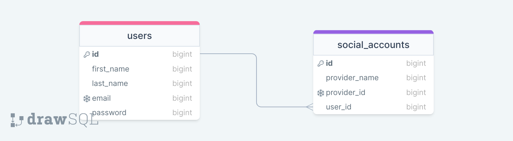

### Package name : mgcodeur/laravel-api-auth-master

#### Summary :
"mgcodeur/laravel-api-auth-master" is a secure and easy to use authentication management package that allows you to manage all aspects related to your application authentication.

#### Features :
-----------------

- Login (using social account, email and password)
- Register
- Update avatar
- Update profile
- Remember me
- Forgot password
- Verify email (OTP, link)
- Change password
- Change email address
- Configuration (use jobs, change route, token expiration time, etc)
- Dashboard for configuration
- API documentation
- Delete account
- Disable account
- Logout
- Logout all devices
- Authentication log


#### How to use :
-----------------
- Install the package using composer 
```bash
composer require mgcodeur/laravel-api-auth-master
```
- Install 
```bash
php artisan mg-auth:install
```

- Migrate the database
```bash
php artisan migrate
```

#### In your Auth Model :
-----------------
- Add the following fields to fillable array
```php
protected $fillable = [
    --//--,
    'first_name',
    'last_name',
];
```


#### Screenshots :

##### Socialite database schema
-----------------


