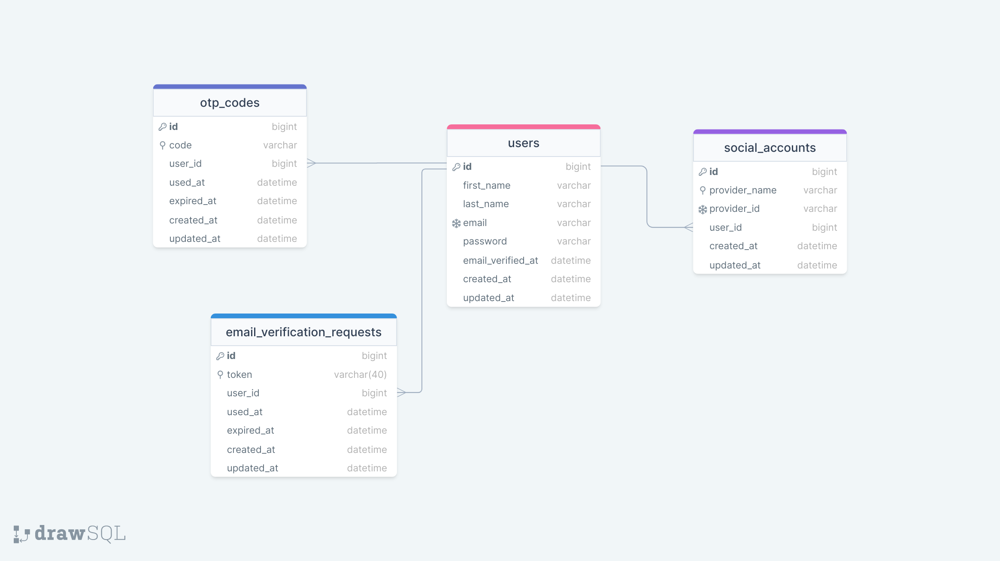

- [About](about.md)
- [Installation](installation.md)

#### About
-----------------

This is a secure and easy to use authentication management package that allows you to manage all aspects related to your application authentication.

#### Features
-----------------

- Login (using social account, email and password)
- Register
- Update avatar
- Update profile
- Remember me
- Forgot password
- Verify email (OTP, link)
- Change password
- Change email address
- Configuration (use jobs, change route, token expiration time, etc)
- Dashboard for configuration
- API documentation
- Delete account
- Disable account
- Logout
- Logout all devices
- Authentication log

#### Database schema :
-----------------

